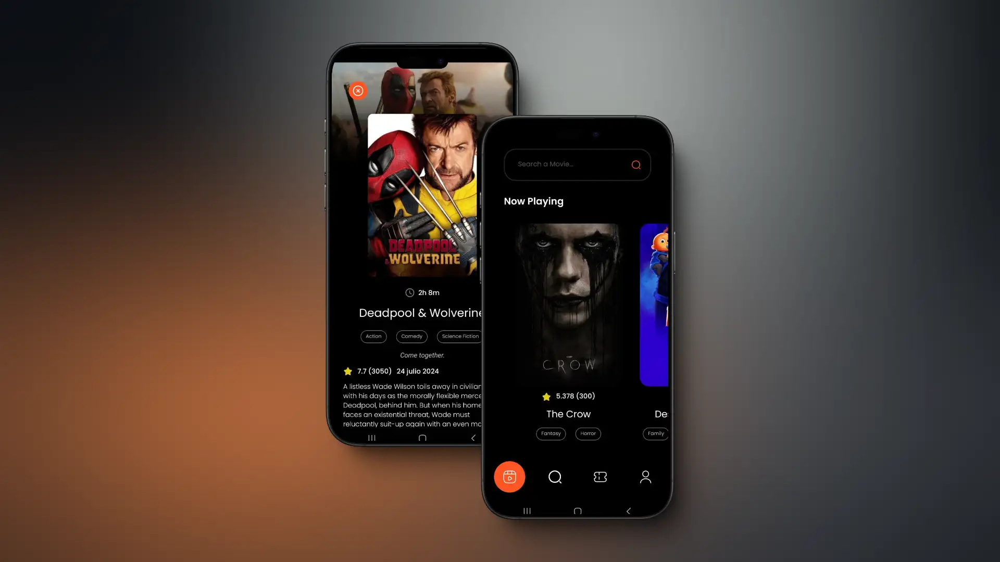
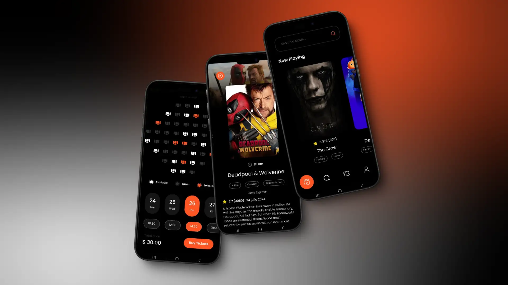
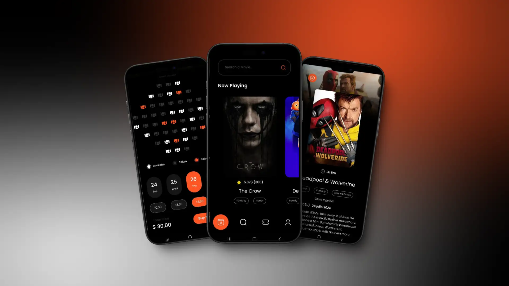

# About the App 

This is a Movie Ticket Booking App built by `Diego Tech` by using:

- React Native
- TypeScript

<br />





<br />

## I used the Libraries 🚀

- React Native Navigation
- React Native Vector Icons
- React Native Linear Gradient
- React Native DotEnv
- React Native Encrypted Storage
- React Native Splash Screen

### One Message for EveryOne 🔥

> [!TIP]
> ```shell
> Aguante Argentina!!!
> Aguante Messi!!!
> ```